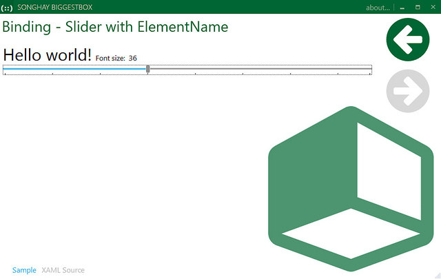
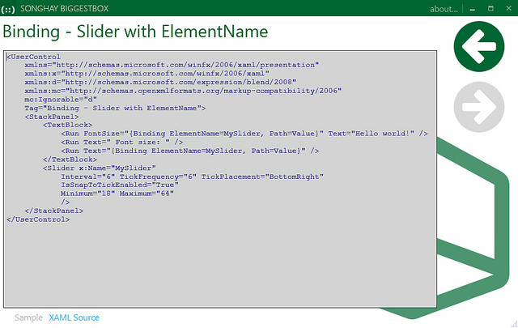
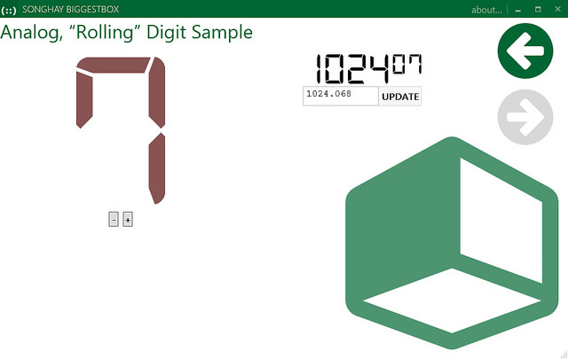
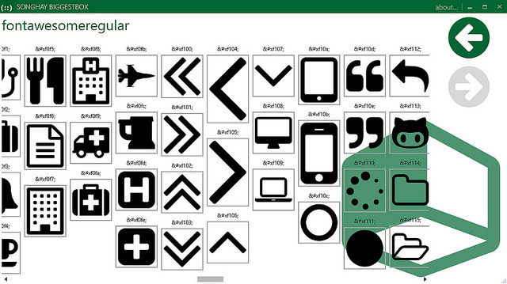

# Songhay.StudioFloor

Note: on CodePlex, this project was called [Songhay BiggestBox](https://wpfbiggestbox.codeplex.com/).

This project is a self-instructional collection showcasing several Microsoft-based desktop technologies and industry-wide techniques including:

* The open source version of [Prism](https://github.com/PrismLibrary/Prism) (6.x), maintained by [Brian Lagunas](http://brianlagunas.com/), [Brian Noyes](http://briannoyes.net/) and [Bart Lannoeye](http://www.bartlannoeye.com/blog)
* The [Unity](https://github.com/unitycontainer/unity) IoC Container under [Unity for Prism](https://www.nuget.org/packages/Prism.Unity/)
* Cross-Platform Development with [.NET Standard](https://docs.microsoft.com/en-us/dotnet/articles/standard/library)
* [mahapps.metro, a UI toolkit for WPF](http://mahapps.com/)

This project contains several Prism Modules, including:

## Packed XAML Samples

Loose XAML files complied as resources and then loaded on the fly. These files are part of [my LinqPad repo on GitHub](https://github.com/BryanWilhite/LinqPad/tree/master/Content/XAML).

## Custom Control Samples

## SVG Fonts Samples in WPF

